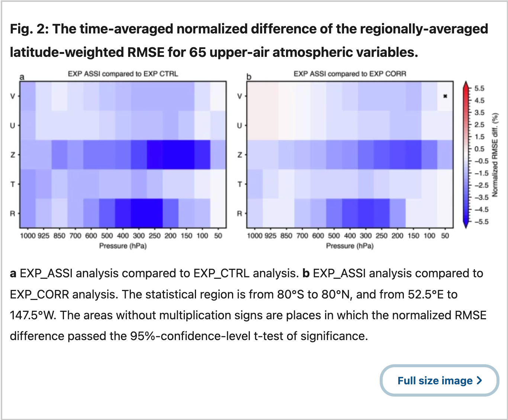
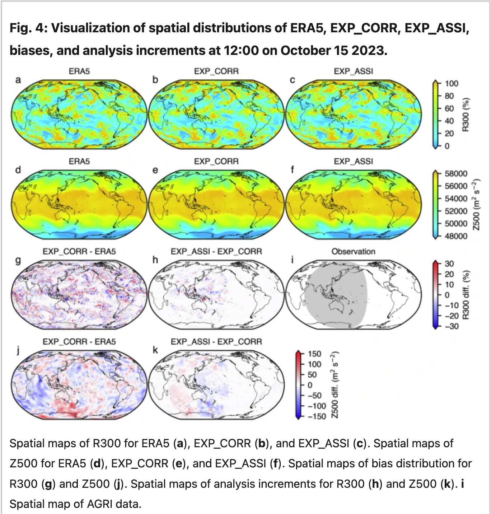
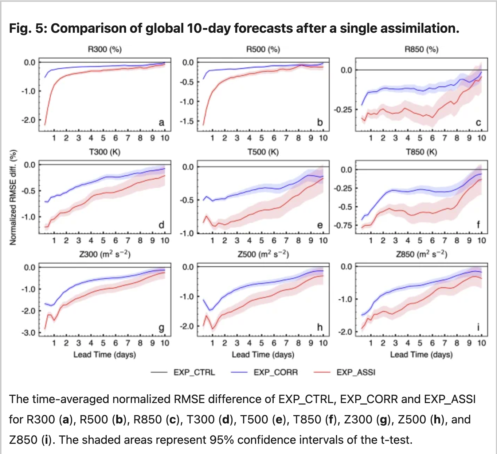

# FuXi-DA: a generalized deep learning data assimilation framework for assimilating satellite observations

使用FuXi作为背景驱动，以ERA5作为输入， 以AGRI（FengYun）作为观测
设计了三个实验
1、EXP_ASSI：同化AGRI
2、EXP_CORR：不同化AGRI，但是设计了一个矫正的模块来训练
3、EXP_CTRL：直接作为背景场

EXP_CORR was designed to highlight the impact of AGRI observations, as the DL model could learn relevant information from historical background-ERA5 pairs, bringing the background field closer to ERA5.
**Analysis verifications**

After assimilating AGRI data using FuXi-DA, a significant reduction in analysis error is observed
引入同化后，分析场的误差有显著降低

To further examine the impact of assimilating AGRI observations, Fig. 4 shows the error distributions and analysis increments at 12:00 on October 15 2023.

**Forecast verifications**
绘制的全都是time-averaged normalized RMSE，比较的是相对值，可以参考绘制进行比较
The normalized RMSE difference between experiment A and experiment B calculated as (RMSEA − RMSEB)/RMSEB

