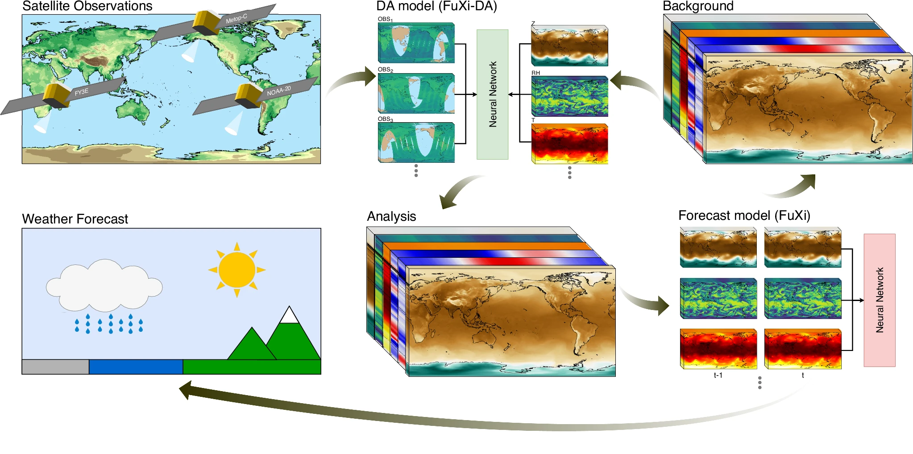

**数据同化重要性与意义**
（输出分析场以提升预报的精度）
Data assimilation (DA), as an indispensable component within contemporary Numerical Weather Prediction (NWP) systems, plays a crucial role in generating the analysis that significantly impacts forecast performance.[https://www.nature.com/articles/s41612-025-01039-3]

（背景场对于预报有重要意义）
Weather forecasting is essentially an “initial value” problem, where the greatest source of uncertainty is the initial conditions6. Therefore, the accuracy of these initial conditions is of paramount importance, regardless of the forecasting method used7,8[https://www.nature.com/articles/s41612-025-01039-3]

(背景场被认作是对现实最准确的刻画)
The analysis is considered the most accurate estimate of the current atmospheric state, obtained by combining short-term forecasts, referred to as the ‘background’, from NWP models with observational data.[https://www.nature.com/articles/s41612-025-01039-3]

(对数据同化的描述)
Data assimilation (DA) integrates observations with model forecasts to produce optimized atmospheric states;Data assimilation (DA) aims to estimate the optimal state of dynamical systems by integrating all available information (1, 2).[https://www.science.org/doi/10.1126/sciadv.aea4248?utm_source=sfmc&utm_medium=email&utm_content=alert&utm_campaign=ADVeToc&et_rid=1124483011&et_cid=5835384]

DA is a complex, nonlinear process that incorporates vast, multi-source, and multi-resolution observational data, often plagued by noise and missing values21, involving challenges such as distinguishing the effects of clouds on satellite radiance from those of temperature and moisture, while ensuring consistency with dynamic models to minimize error growth.[https://www.nature.com/articles/s41467-025-62024-1]

**预报的重要性**
Accurate weather forecasts are crucial for saving lives, emergency management, mitigating disaster impacts, and preventing economic losses due to severe weather events.[https://www.nature.com/articles/s41612-025-01039-3]

Accurate weather forecasting is essential for informed decision-making and serves as the foundation of early warning systems1,2 that help to mitigate the impacts of extreme weather events and save lives.[https://www.nature.com/articles/s41467-025-62024-1]

Drought is one of the most pressing environmental challenges, with devastating impacts across a wide range of sectors, including agriculture, economy, and ecosystems (Li et al., 2021; Williams et al., 2020).[https://agupubs.onlinelibrary.wiley.com/doi/10.1029/2024WR039744?af=R]

**对于模型过程的描述**
As shown in Fig. 1, the FuXi-DA model is trained using ERA5 reanalysis data as labels and the fixed FuXi model is used to provide forecast supervision (a detailed description is provided in the Model training section).Data from June 2022 to June 2024 are used to train the FuXi-DA model, and data from August 2023 to December 2023 are used to evaluate its performance.(训练数据的时间范围)The assimilation process is performed daily at 00:00, 06:00, 12:00, and 18:00 UTC. Due to the limited spatial coverage and informational content of the observations, the evaluation was not performed under a cycling assimilation scenario.[https://www.nature.com/articles/s41612-025-01039-3]

RISE-Unet accepts an arbitrary number of input predictors (channels) from both reanalysis at weekly lags and reforecast at forecast leads, and passes weighted convolution kernels across each channel to produce intermediate predictions, which are concatenated. Additional convolution kernels are passed along all intermediate predictions, and the image size is reduced through pooling operations, which allow different representations of the data to be computed within a more restricted field space, allowing the model to identify relevant features at different scales. These intermediate results are concatenated again, and the convolution/pooling process repeats until a minimal image size is reached (in our instance, a 48 × 96 pixel image is reduced to a 6 × 12 pixel image). Once the terminal size is reached, intermediate predictions are upscaled until the original image size is reached.[https://www.nature.com/articles/s41467-025-62761-3#data-availability]

Figure 7 illustrates FuXi Weather, which generates global weather forecasts every 6 h. It has three main components: satellite data preprocessing (detailed in Supplementary Information Section 2.1), DA via FuXi-DA, and forecasting using the FuXi model. A complete list of variables and abbreviations is provided in Table 1.

**同化后结果变好**
The results indicate that the assimilation of AGRI observations leads to a significant reduction in RMSEs across all variables, most notably in relative humidity and geopotential.[https://www.nature.com/articles/s41612-025-01039-3]

**不足描述**
(对于极端事件的预报存在不足)
However, it still modestly underestimates the spatial extent and intensity of the drought, indicating room for further improvement in extreme event prediction.[https://www.nature.com/articles/s41467-025-62761-3#data-availability]

(对于干旱预报的准确性受到大气驱动变量的影响，可以参考这里)
Dynamical and statistical methods are two primary approaches used for drought prediction. While dynamical models solve the physical principles governing weather dynamics, their accuracy is constrained by the stochastic nature of the atmosphere and uncertainties in model initialization, boundary conditions, and parameterizations.[https://agupubs.onlinelibrary.wiley.com/doi/10.1029/2024WR039744?af=R]

(由于GEFS的气象驱动和实际观测存在差距，可以通过迁移模型来提升预报精度)
While this study demonstrates the potential of ADAF, several limitations should be noted. When evaluating the ADAF-generated analysis fields through forecast performance, we only conducted 12-hr forecasts without incorporating the model forecast as background during DA, which is a cyclic-DA setup. This is because the inconsistencies between ADAF-generated analysis and the AI forecasting model can accumulate and amplify during DA cycles. To address this limitation, transfer learning could be used to jointly fine-tune both ADAF and the AI-based forecasting model, ensuring better consistency between analysis and forecast.[https://agupubs.onlinelibrary.wiley.com/doi/10.1029/2024MS004839?af=R]